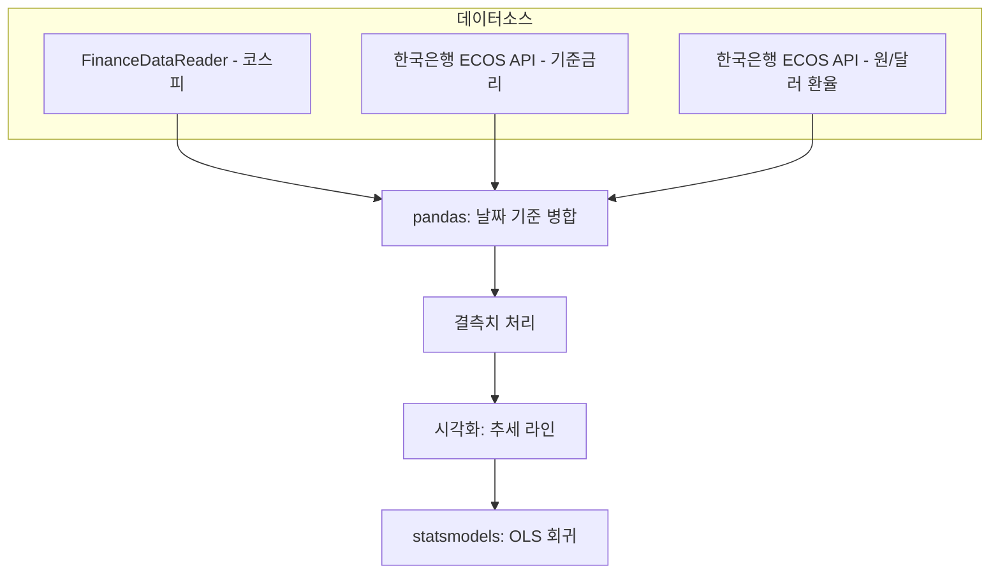

# 코스피 반응 지연 분석 (KOSPI Lag Effect Analytics)

  

[English](README.md) | 한국어

기준금리와 원/달러 환율 변동이 코스피 지수와 어떤 관계가 있는지, 공개 데이터와 회귀분석으로 검증하는 프로젝트입니다.

---

## 목차

- [개요](#개요)
- [아키텍처](#아키텍처)
- [분석 파이프라인](#분석-파이프라인)
- [기술 스택](#기술-스택)
- [실행 방법](#실행-방법)
- [결과](#결과)
- [로드맵](#로드맵)
- [배경](#배경)

---

## 개요

공개된 시계열 데이터를 활용해 거시경제 지표(기준금리, 환율)와 코스피 지수 간의 관계를 분석합니다. 데이터 수집, 상관분석, 회귀 모델링에 더해 시차(lag) 분석까지 포함하여 통화정책 변화가 지연 효과를 갖고 주식시장에 반영되는지 검증합니다.

**목표**: 단순한 차트 관찰을 넘어, 재현 가능하고 통계적으로 근거 있는 금리·환율-증시 관계 분석을 만드는 것.

---

## 아키텍처

### 전체 시스템 개요


프로젝트는 데이터 수집 - 통계 분석 - 리포팅 3개 레이어로 구성됩니다. 각 레이어의 결과물이 다음 단계 모델링에 반영됩니다.

### 데이터 파이프라인 아키텍처



- 데이터 출처: FinanceDataReader(코스피), 한국은행 ECOS API(금리, 환율)
- 기간: 최근 5~10년 월별 데이터

---

## 분석 파이프라인


- **데이터**: 코스피 월별 종가, 기준금리, 원/달러 환율
- **모델**: 다중 선형회귀(코스피 ~ 금리 + 환율), 시차 변수 포함
- **검증**: R², p-value, 잔차 진단
- **결과물**: 계수 해석과 시차 효과 차트가 포함된 회귀분석 리포트

---

## 기술 스택

| 구분      | 도구                              |
| --------- | ----------------------------------- |
| 데이터 수집 | FinanceDataReader, ECOS API         |
| 데이터 처리 | pandas, numpy                       |
| 시각화     | matplotlib, seaborn                 |
| 모델링     | statsmodels                         |

---

## 실행 방법

```bash
# 레포 클론
git clone https://github.com/<your-username>/<repo-name>.git
cd <repo-name>

# 의존성 설치
pip install -r requirements.txt

# 데이터 수집 실행
python src/collect_data.py

# 분석 실행
python src/run_analysis.py
```

> 세부 실행 방법은 `/src`, `/notebooks` 폴더에 문서화되어 있습니다.

---

## 결과

> 프로젝트 진행에 따라 채워질 예정 — 목표: 상관계수, 회귀 R², 시차 효과 결과.

| 지표                     | 값 |
| --------------------------- | ----- |
| 코스피-금리 상관계수       | TBD   |
| 코스피-환율 상관계수         | TBD   |
| 회귀 R²               | TBD   |
| 유의한 시차(개월)    | TBD   |

---

## 로드맵

- [x] 프로젝트 범위 및 아키텍처 설계
- [x] 다이어그램 설계
- [ ] 데이터 수집 스크립트
- [ ] 데이터 정제 및 병합 파이프라인
- [ ] 상관분석
- [ ] 회귀 모델링
- [ ] 시차 분석
- [ ] 최종 리포트

---

## 배경

통계데이터학과 개별 프로젝트의 일환으로, 공개 데이터 수집부터 회귀 모델링까지 전체 분석 흐름을 Python으로 연습하기 위해 진행합니다.
