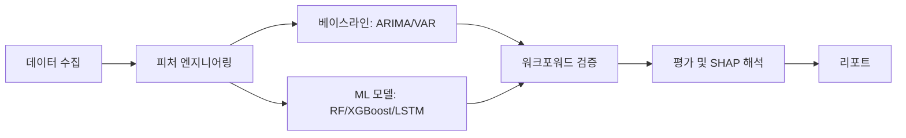
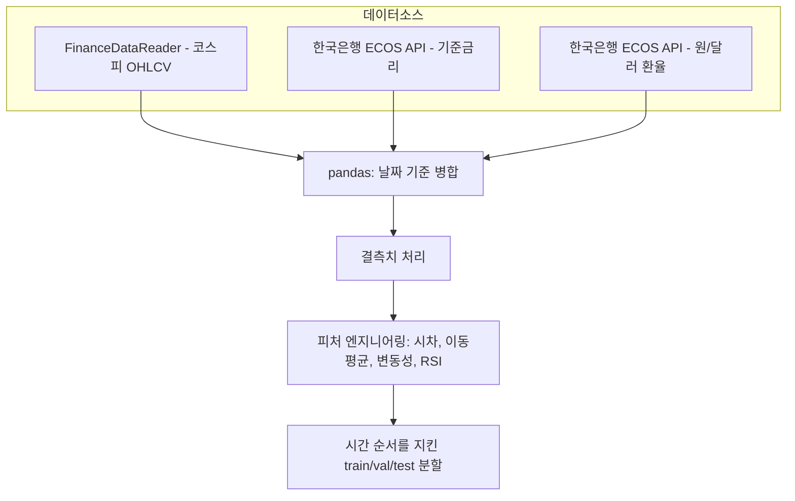
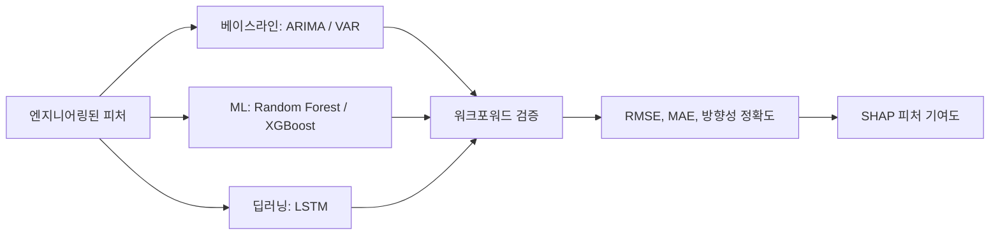

# 코스피 예측 분석 (KOSPI Predictive Analytics)

  

[English](README.md) | 한국어

기준금리·원/달러 환율과 기술적 지표로 코스피 지수를 예측하고, 고전적 시계열 베이스라인과 머신러닝 모델을 워크포워드 검증(walk-forward validation)으로 비교한 뒤 SHAP으로 해석하는 프로젝트입니다.

---

## 목차

- [개요](#개요)
- [아키텍처](#아키텍처)
- [분석 파이프라인](#분석-파이프라인)
- [기술 스택](#기술-스택)
- [실행 방법](#실행-방법)
- [결과](#결과)
- [로드맵](#로드맵)
- [배경](#배경)

---

## 개요

이 프로젝트는 두 가지 연결된 질문을 다룹니다. (1) 기준금리와 원/달러 환율 변화가 코스피 지수에 지연되어 반영되는가, (2) 이 시차 관계를 기술적 지표와 결합하면 단순 상관관계 설명을 넘어 실제로 쓸만한 예측 모델을 만들 수 있는가. 고전적 계량경제 베이스라인(ARIMA/VAR)과 시차효과 회귀분석에서 시작해, 트리 기반 ML(Random Forest/XGBoost)과 LSTM을 시계열에 맞는 검증 방식으로 벤치마킹하고, SHAP 기반 피처 해석으로 모델이 블랙박스가 아니라 검증 가능하게 만듭니다.

**목표**: 엄격한 베이스라인 비교와 워크포워드 검증을 통해, ML 예측이 이 문제에서 실제로 고전적 시계열 기법보다 나은지 — 그리고 왜 그런지 — 보여주는 것.

---

## 아키텍처

### 전체 시스템 개요



프로젝트는 데이터 수집 - 피처 엔지니어링 - 베이스라인 vs ML 모델링 비교 - 평가/해석 4개 레이어로 구성됩니다. 베이스라인 레이어는 ML 레이어가 정당하게 비교될 대상을 만들기 위해 존재합니다.

### 데이터 파이프라인 아키텍처



- 데이터 출처: FinanceDataReader(코스피), 한국은행 ECOS API(금리, 환율)
- 기간: 최근 5~10년 일별/월별 데이터
- 분할: 랜덤 셔플 없이 엄격히 시간 순서대로 분할 (데이터 누수 방지)

---

## 분석 파이프라인



- **베이스라인**: 원본 금리+환율+코스피 시계열에 대한 ARIMA와 VAR, 그리고 기존의 시차효과 회귀(코스피 ~ 금리 + 환율, lag 포함)를 설명적 벤치마크로 사용
- **ML 모델**: 시차, 이동평균, 변동성, RSI 등 엔지니어링된 피처에 Random Forest / XGBoost 적용, LSTM을 딥러닝 비교 대상으로 추가
- **검증**: 시계열에 k-fold를 쓰지 않고, 워크포워드(rolling-origin) 검증으로 시간 순서를 유지
- **평가지표**: 크기 오차용 RMSE/MAE, 실무적 의미를 위한 방향성 정확도(상승/하락 예측 적중률)
- **해석**: 최고 성능 ML 모델에 SHAP을 적용해, 어떤 피처(금리 시차, 환율 시차, 변동성 등)가 실제로 예측을 견인하는지 확인
- **결과물**: 베이스라인 vs ML 비교표, 워크포워드 성능 차트, SHAP 요약 플롯

---

## 기술 스택

| 구분           | 도구                                      |
| ------------------ | -------------------------------------------- |
| 데이터 수집       | FinanceDataReader, ECOS API                 |
| 데이터 처리       | pandas, numpy                               |
| 고전 베이스라인   | statsmodels (ARIMA, VAR)                    |
| ML 모델링         | scikit-learn (Random Forest), XGBoost       |
| 딥러닝            | PyTorch 또는 TensorFlow/Keras (LSTM)        |
| 해석              | SHAP                                        |
| 시각화            | matplotlib, seaborn                         |

---

## 실행 방법

```bash
# 레포 클론
git clone https://github.com/<your-username>/<repo-name>.git
cd <repo-name>

# 의존성 설치
pip install -r requirements.txt

# 데이터 수집 실행
python src/collect_data.py

# 피처 생성
python src/build_features.py

# 베이스라인 및 ML 모델 학습
python src/train_baselines.py
python src/train_models.py

# 워크포워드 평가 + SHAP 실행
python src/evaluate.py
```

> 세부 실행 방법은 `/src`, `/notebooks` 폴더에 문서화되어 있습니다.

---

## 결과

> 프로젝트 진행에 따라 채워질 예정 — 목표: 베이스라인 vs ML 성능 비교, 방향성 정확도, 주요 SHAP 피처.

| 모델                  | RMSE | 방향성 정확도 |
| ------------------------ | ---- | --------------- |
| ARIMA (베이스라인)         | TBD  | TBD              |
| VAR (베이스라인)           | TBD  | TBD              |
| 시차 회귀 (베이스라인)     | TBD  | TBD              |
| Random Forest / XGBoost   | TBD  | TBD              |
| LSTM                      | TBD  | TBD              |

| 지표                        | 값 |
| -------------------------------- | ----- |
| 최고 성능 모델                    | TBD   |
| 최상위 SHAP 피처                  | TBD   |
| 유의한 시차(개월)                 | TBD   |

---

## 로드맵

- [x] 프로젝트 범위 및 아키텍처 설계
- [x] 다이어그램 설계
- [ ] 데이터 수집 스크립트
- [ ] 피처 엔지니어링 (시차, 기술적 지표)
- [ ] 베이스라인 모델 (ARIMA, VAR, 시차 회귀)
- [ ] ML 모델 (Random Forest, XGBoost)
- [ ] LSTM 모델
- [ ] 워크포워드 검증 프레임워크
- [ ] SHAP 해석
- [ ] 베이스라인-ML 비교 리포트
- [ ] 최종 리포트

---

## 배경

통계데이터학과 개별 프로젝트의 일환으로, 머신러닝/예측모델링 대학원 트랙과 산업 데이터사이언스 포트폴리오를 겨냥한 플래그십 프로젝트로 설계했습니다. 단순히 ML을 예측 문제에 적용하는 것을 넘어, 고전적 시계열 기법과 정직하게 벤치마킹하고, 데이터 누수 없이 검증하며, 블랙박스가 아니라 해석 가능하게 만드는 것을 목표로 합니다.
