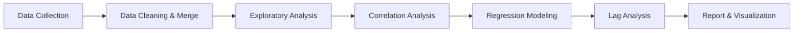
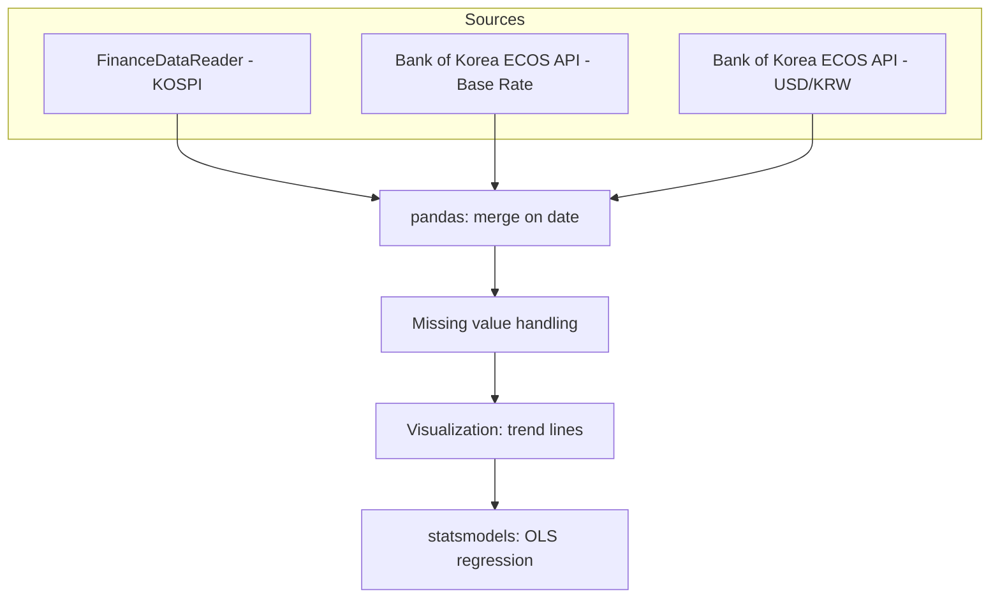
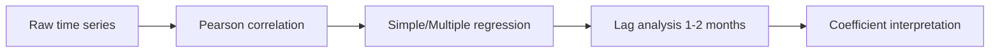

# KOSPI Lag Effect Analytics

  

English | [한국어](README.ko.md)

Analyzing how base interest rate and USD/KRW exchange rate movements relate to the KOSPI index, using public financial data and regression analysis.

---

## Table of contents

- [Overview](#overview)
- [Architecture](#architecture)
- [Analysis pipeline](#analysis-pipeline)
- [Tech stack](#tech-stack)
- [Setup](#setup)
- [Results](#results)
- [Roadmap](#roadmap)
- [Background](#background)

---

## Overview

This project explores the relationship between macroeconomic indicators (base rate, exchange rate) and the KOSPI index using publicly available time-series data. It combines data collection, correlation analysis, and regression modeling — including lagged-effect analysis — to test whether monetary policy changes show up in the stock market with a delay.

**The goal:** move from casual chart-watching to a reproducible, statistically grounded view of how rates and FX relate to the market.

---

## Architecture

### System overview



The project is organized into three layers: data collection, statistical analysis, and reporting. Each layer's output feeds into the next stage of modeling.

### Data pipeline architecture



- Data source: FinanceDataReader (KOSPI), Bank of Korea ECOS API (rate, FX)
- Period: monthly data, most recent 5–10 years

---

## Analysis pipeline



- **Data**: KOSPI monthly close, base rate, USD/KRW exchange rate
- **Model**: multiple linear regression (KOSPI ~ rate + FX), with lagged variables
- **Validation**: R², p-value, residual diagnostics
- **Output**: regression report with coefficient interpretation and lag effect chart

---

## Tech stack

| Category      | Tools                              |
| -------------- | ----------------------------------- |
| Data collection | FinanceDataReader, ECOS API         |
| Data handling  | pandas, numpy                       |
| Visualization  | matplotlib, seaborn                 |
| Modeling       | statsmodels                         |

---

## Setup

```bash
# clone the repo
git clone https://github.com/<your-username>/<repo-name>.git
cd <repo-name>

# install dependencies
pip install -r requirements.txt

# run data collection
python src/collect_data.py

# run analysis
python src/run_analysis.py
```

> Detailed steps documented under `/src` and `/notebooks`.

---

## Results

> To be filled in as the project progresses — target: correlation coefficients, regression R², and lag-effect findings.

| Metric                     | Value |
| --------------------------- | ----- |
| KOSPI–rate correlation       | TBD   |
| KOSPI–FX correlation         | TBD   |
| Regression R²               | TBD   |
| Significant lag (months)    | TBD   |

---

## Roadmap

- [x] Project scope & architecture design
- [x] Diagram design
- [ ] Data collection scripts
- [ ] Data cleaning & merge pipeline
- [ ] Correlation analysis
- [ ] Regression modeling
- [ ] Lag analysis
- [ ] Final report

---

## Background

This project is part of an individual coursework project for a Statistics & Data Science major, built to practice the full analysis workflow — from public data collection through regression modeling — using Python.
