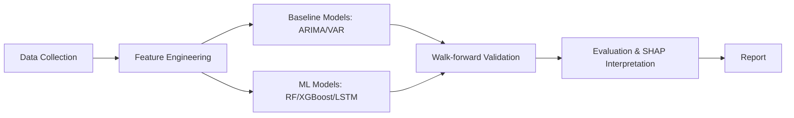
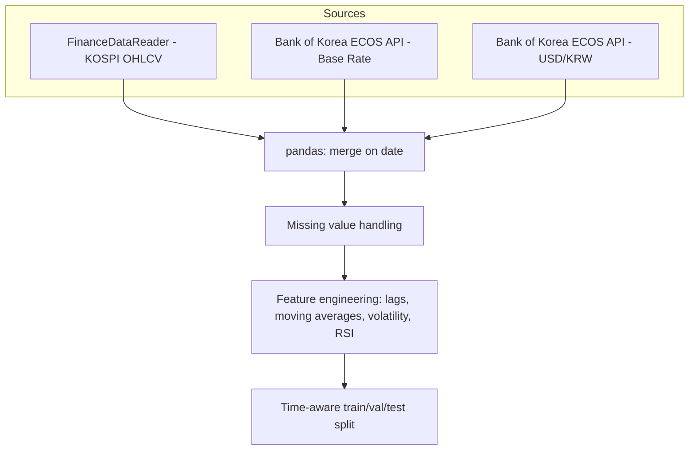
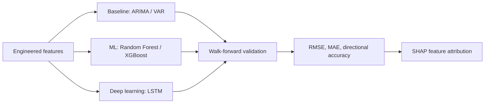

# KOSPI Predictive Analytics

  

English | [한국어](README.ko.md)

Forecasting KOSPI movements from macro indicators (base rate, USD/KRW) and technical features, benchmarking classical time-series baselines against machine learning models with walk-forward validation and SHAP-based interpretation.

---

## Table of contents

- [Overview](#overview)
- [Architecture](#architecture)
- [Analysis pipeline](#analysis-pipeline)
- [Tech stack](#tech-stack)
- [Setup](#setup)
- [Results](#results)
- [Roadmap](#roadmap)
- [Background](#background)

---

## Overview

This project asks two connected questions: (1) do base rate and USD/KRW exchange rate changes show up in the KOSPI index with a delay, and (2) can that lagged relationship, combined with technical indicators, be turned into a genuinely useful forecasting model — not just a correlation story? It starts from classical econometric baselines (ARIMA/VAR) and lag-effect regression, then benchmarks tree-based ML (Random Forest/XGBoost) and an LSTM against those baselines under time-series-correct validation, and closes the loop with SHAP-based feature attribution so the model's reasoning is auditable rather than a black box.

**The goal:** show, with rigorous baseline comparison and walk-forward validation, whether ML forecasting actually beats classical time-series methods on this problem — and why.

---

## Architecture

### System overview



The project has four layers: data collection, feature engineering, a baseline-vs-ML modeling comparison, and an evaluation/interpretation layer. The baseline layer exists specifically so the ML layer has something honest to be compared against.

### Data pipeline architecture



- Data source: FinanceDataReader (KOSPI), Bank of Korea ECOS API (rate, FX)
- Period: daily/monthly data, most recent 5–10 years
- Split: strictly chronological — no random shuffling, to avoid leakage

---

## Analysis pipeline



- **Baselines**: ARIMA and VAR on the raw macro + KOSPI series, including the original lag-effect regression (KOSPI ~ rate + FX, lagged) as an explanatory benchmark
- **ML models**: Random Forest / XGBoost on engineered features (lags, moving averages, volatility, RSI); LSTM as a deep-learning comparison point
- **Validation**: walk-forward (rolling-origin) validation — never k-fold on time series — to keep the temporal order intact
- **Metrics**: RMSE / MAE for magnitude, directional accuracy (up/down) for practical relevance
- **Interpretation**: SHAP values on the best ML model, to identify which features (rate lag, FX lag, volatility, etc.) actually drive predictions
- **Output**: a baseline-vs-ML comparison table, walk-forward performance chart, and SHAP summary plot

---

## Tech stack

| Category         | Tools                                      |
| ------------------ | -------------------------------------------- |
| Data collection    | FinanceDataReader, ECOS API                 |
| Data handling      | pandas, numpy                               |
| Classical baseline | statsmodels (ARIMA, VAR)                    |
| ML modeling        | scikit-learn (Random Forest), XGBoost       |
| Deep learning      | PyTorch or TensorFlow/Keras (LSTM)          |
| Interpretation     | SHAP                                        |
| Visualization      | matplotlib, seaborn                         |

---

## Setup

```bash
# clone the repo
git clone https://github.com/<your-username>/<repo-name>.git
cd <repo-name>

# install dependencies
pip install -r requirements.txt

# run data collection
python src/collect_data.py

# build features
python src/build_features.py

# train baselines and ML models
python src/train_baselines.py
python src/train_models.py

# run walk-forward evaluation + SHAP
python src/evaluate.py
```

> Detailed steps documented under `/src` and `/notebooks`.

---

## Results

> To be filled in as the project progresses — target: baseline vs. ML performance comparison, directional accuracy, and top SHAP features.

| Model              | RMSE | Directional accuracy |
| -------------------- | ---- | --------------------- |
| ARIMA (baseline)      | TBD  | TBD                    |
| VAR (baseline)        | TBD  | TBD                    |
| Lag regression (baseline) | TBD | TBD              |
| Random Forest / XGBoost | TBD | TBD                  |
| LSTM                  | TBD  | TBD                    |

| Metric                        | Value |
| -------------------------------- | ----- |
| Best model                       | TBD   |
| Top SHAP feature                 | TBD   |
| Significant lag (months)         | TBD   |

---

## Roadmap

- [x] Project scope & architecture design
- [x] Diagram design
- [ ] Data collection scripts
- [ ] Feature engineering (lags, technical indicators)
- [ ] Baseline models (ARIMA, VAR, lag regression)
- [ ] ML models (Random Forest, XGBoost)
- [ ] LSTM model
- [ ] Walk-forward validation framework
- [ ] SHAP interpretation
- [ ] Baseline-vs-ML comparison report
- [ ] Final report

---

## Background

This project is part of an individual coursework project for a Statistics & Data Science major, built as a flagship piece toward a machine learning / predictive modeling graduate school track and industry data science portfolio. It's designed to demonstrate not just that ML can be applied to a forecasting problem, but that it can be honestly benchmarked against classical time-series methods, validated without leakage, and interpreted rather than treated as a black box.
